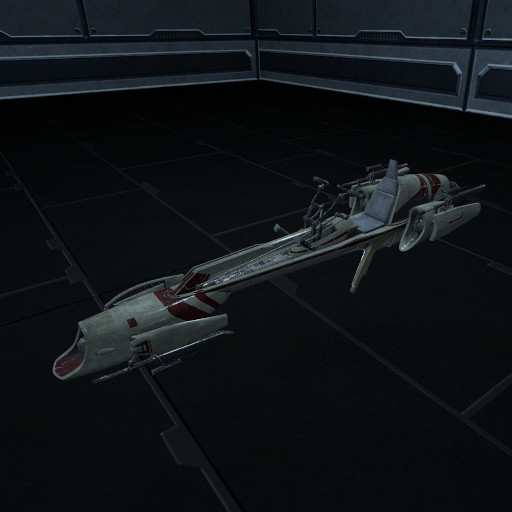
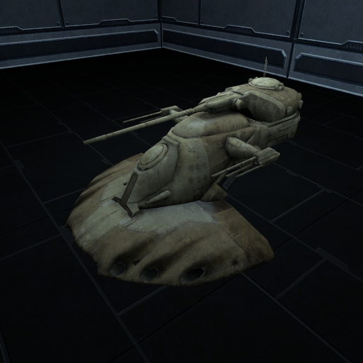
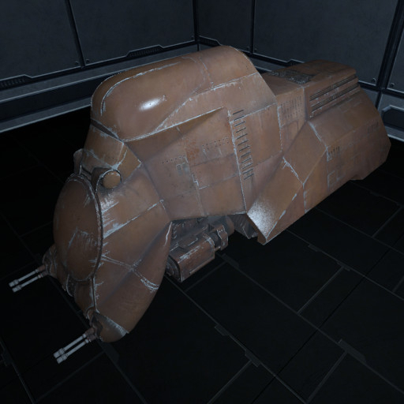

# Examples

Sample vehicles can be found [here](https://github.com/ianespana/lfs_ground_base_extra).

Feel free to disect them and experiment with them. They show how to use the ground base for small, medium and large vehicles.

## [BARC Speeder](https://github.com/ianespana/lfs_ground_base_extra/tree/main/BARC%20Speeder)

## [AAT](https://github.com/ianespana/lfs_ground_base_extra/tree/main/AAT)

## [MTT](https://github.com/ianespana/lfs_ground_base_extra/tree/main/MTT)

